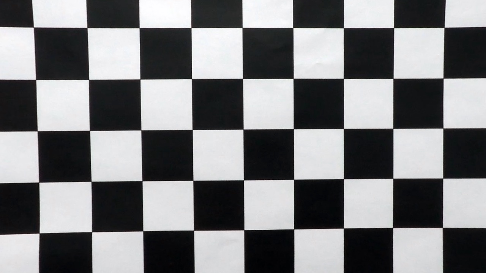
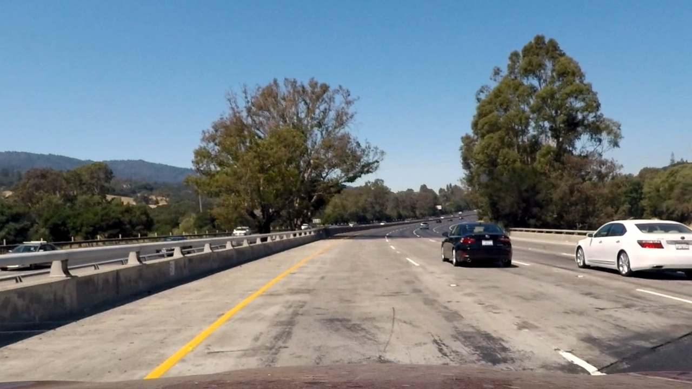
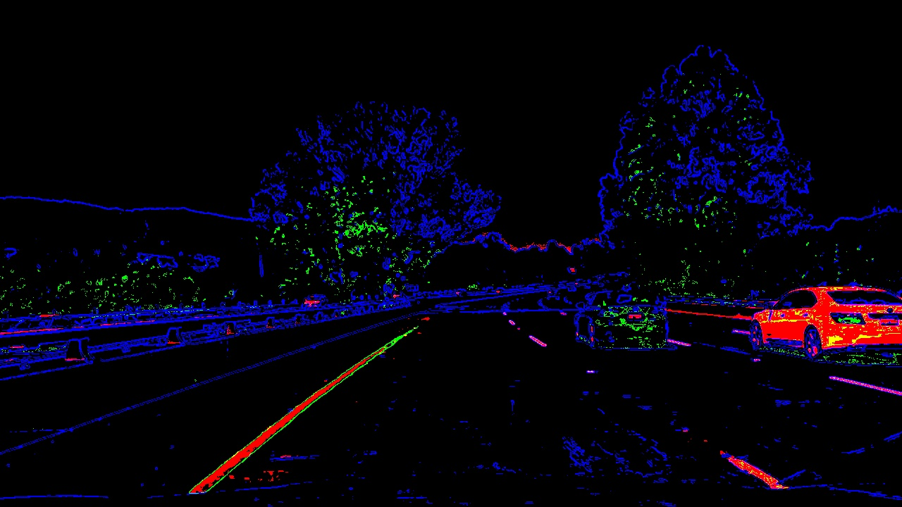
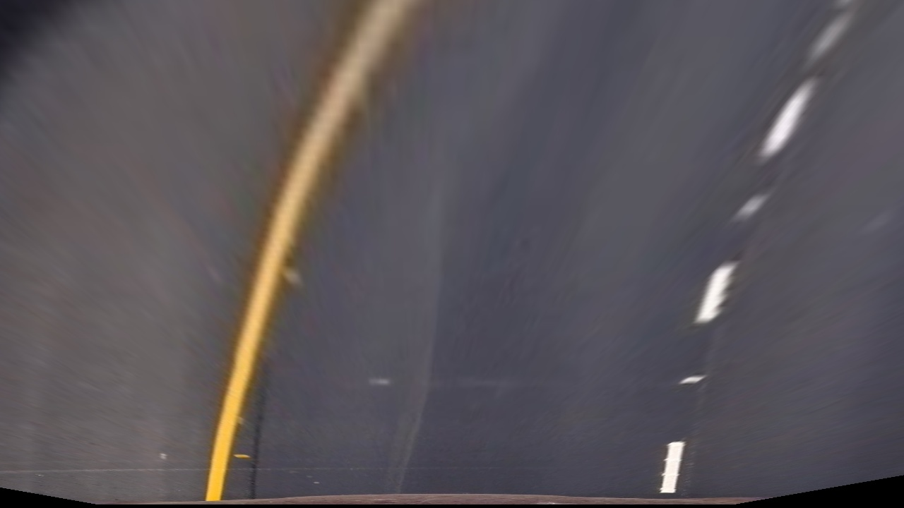
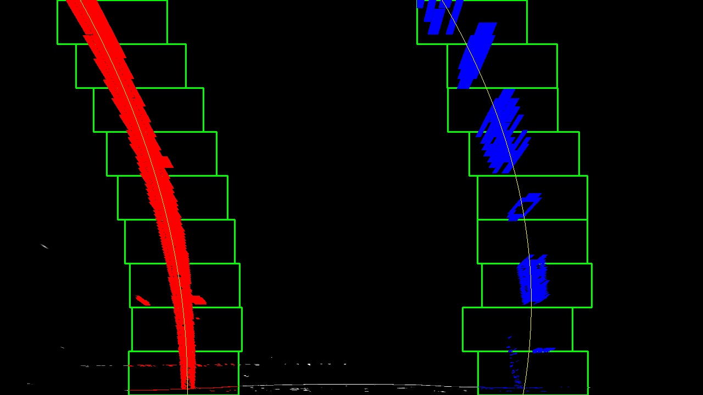
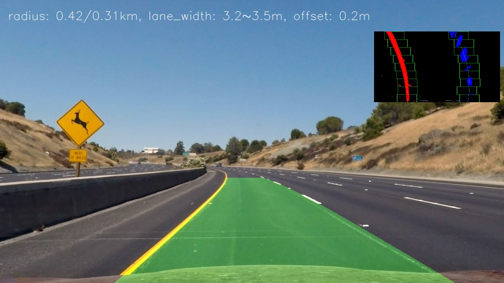

# Advanced Lane Finding Project

The goals / steps of this project are the following:

* Compute the camera calibration matrix and distortion coefficients given a set of chessboard images.
* Apply a distortion correction to raw images.
* Use color transforms, gradients, etc., to create a thresholded binary image.
* Apply a perspective transform to rectify binary image ("birds-eye view").
* Detect lane pixels and fit to find the lane boundary.
* Determine the curvature of the lane and vehicle position with respect to center.
* Warp the detected lane boundaries back onto the original image.
* Output visual display of the lane boundaries and numerical estimation of lane curvature and vehicle position.

[//]: # (Image References)

[image1]: ./examples/undistort_output.png "Undistorted"
[image2]: ./test_images/test1.jpg "Road Transformed"
[image3]: ./examples/binary_combo_example.jpg "Binary Example"
[image4]: ./examples/warped_straight_lines.jpg "Warp Example"
[image5]: ./examples/color_fit_lines.jpg "Fit Visual"
[image6]: ./examples/example_output.jpg "Output"
[video1]: ./project_video.mp4 "Video"

### Camera Calibration

I did the camera calibration in an IPython notebook [camera_calibration.ipynb](camera_calibration.ipynb).  

First, I create a grid of chessboard corners on the z=0 plane.
Second, I detect the chessboard corners in each of the calibration images using `cv2.findChessboardCorners()`.
Then, I used the chessboard corners and detected image points to calibrate the camera using `cv2.calibrateCamera()`.
The output is a calibration matrix and distortion coefficients. I store the output to a pickle file.

Below is an example of undistortion. More examples can be found in [camera_calibration.ipynb](camera_calibration.ipynb).

### Pipeline (single images)
The pipeline is implemented in IPyhton notebook [pipeline.ipynb](pipeline.ipynb).
`Pipeline` is the main class and `process_image()` is the main function.

#### 1. Undistort the raw image.
The first step is to undistort the raw image, which is implemented using
`cv2.undistort()` with the calibration matrix and distortion coefficients.
Below is an example undistorted image:

#### 2. Color and gradient thresholding.

I used a combination of color and gradient thresholds in `threshold_image()`:
1. RGB threshold [200, 200, 10].
2. S-channel threshold [150, 200] in the HLS color space.
3. Gradient threshold: convert to grayscale; Gaussian blurring; Sobel filtering with magnitude threshold [40, 100].
Below is an example thresholded image (Red for RGB; Green for S-channel; Blue for gradient):

#### 3. Perspective transform.
I pre-computed the perspective transform matrix and inverse matrix in
`get_perspective_transform()`. The source and destination points were manually
picked from an example image.
Then, in the function `process_image()` I perform the perspective transform.
Below is an example warped image:

#### 4. Find lane-line pixels and and fit their positions with a polynomial.

I implemented two methods for finding lane-line pixels. One is from scratch using histogram and sliding windows (`find_lane_pixels_by_sliding_windows()`). The other is by searching from previous polynomial area (`search_by_prev_poly()`).
The found lane pixels are then fit to a second order polynomial (`fit_poly()`).
I visualized the search area, the found lane-line pixels, and the fit polynomial. Below is an example of this step:

#### 5. Calculate the radius of curvature of the lane and the position of the vehicle with respect to center.

I use the formula in the course to compute the radius:
Radius = (1 + (2Ay + B)**2)**1.5 / |2A|
To convert the formula to the real world, I derived A' and B' as follow.
x = Ay**2 + By + C
x' = ax, y'=by, where a is xm_per_pix, b is ym_per_pix.
x'/a = A(y'/b)**2 + B(y'/b) + C
or x' = aA/b**2 y'**2 + aB/b y' + C.
Thus, A' = aA/b**2, B'=aB/b.
The formula is implemented in `compute_radius()`.

The car position is computed as the diff between image center and the lane-line center.

#### 6. Warp back onto the road with visualization.

I filled the identified lane area between the fitted left and right polynomials. Then warped back onto the road using `cv2.warpPerspective()` with the inverse matrix. This is implemented in `Pipeline.process_image()`. I also plot the radius, car position, and lane-fit visualization.
Below is an example:

#### 7. Sanity check and tracking previous fitted polynomials for video.
I did a sanity check on lane widthds, left and right radiuses, and the car position (`Pipeline.process_image()`).
If the sanity check passed, then I keep the polynomials and use it for lane-line pixels search in subsequent frames.
Otherwise, if there exists previous polynomials then I reuse the previous poly to plot the lane area.
---

### Pipeline (video)

I use the same video processing code as in the previous project.
Here are the processed videos:

* [output_images/project_video.mp4](output_images/project_video.mp4).
* [output_images/challenge_video.mp4](output_images/challenge_video.mp4)
* [output_images/harder_challenge_video.mp4](output_images/harder_challenge_video.mp4)

---

### Discussion

My implementation doesn't work quite well on the challenge videos. I could improve these areas if I were going to pursue this project further:

* Image thresholding. The yellow lane-line are sometimes not identified, and there are other pixels mis-identified as lane line pixels. I could sample the lane-line pixels and not lane-line pixels to fine tune the thresholds.

* Sanity check. My santiy check conditions are relatively conservative. There is a big headroom for tuning the sanity check thresholds.

* Tracking and smoothing. It would be worth to tune how many frames to track back, when to reset the previous fits, and how to smooth over previous fits.

